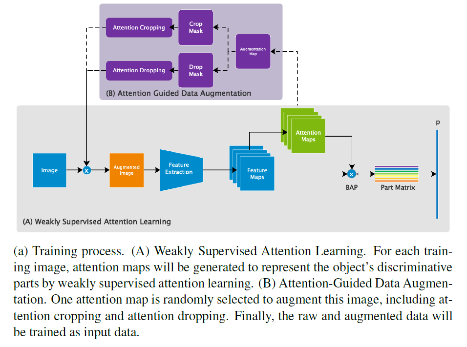
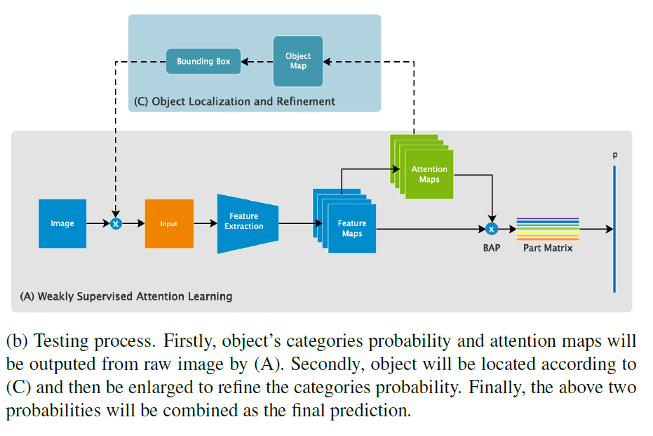
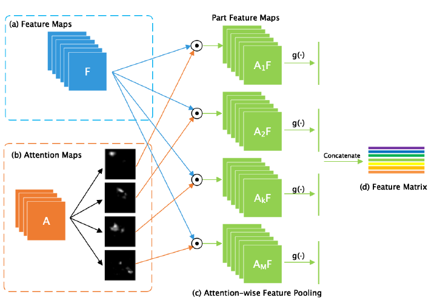

# WS-DAN.PyTorch
A PyTorch implementation of WS-DAN (Weakly Supervised Data Augmentation Network) for FGVC (Fine-Grained Visual Classification). (Hu et al., ["See Better Before Looking Closer: Weakly Supervised Data Augmentation
Network for Fine-Grained Visual Classification"](https://arxiv.org/abs/1901.09891v2), arXiv:1901.09891)

**NOTICE: This is NOT an official implementation by authors of WS-DAN.**

**The official implementation is now available at [tau-yihouxiang/WS_DAN](https://github.com/tau-yihouxiang/WS_DAN).**


## Attention Cropping and Attention Dropping


The framework introduce an attention based method for extracting more detailed features and more object's parts by Attention Cropping and Attention Dropping, see Fig 1. 

## Training Process and  Testing Process 




## Bilinear Attention Pooling (BAP)



## Usage
This code repo contains WS-DAN with feature extractors including VGG19, ResNet(34, 50, 101, 152), and Inception_v3 in PyTorch form. The default feature extractor is Inception_v3, and this can be modified conveniently in ```train_wsdan.py```: 

```python
# feature_net = vgg19_bn(pretrained=True)
# feature_net = resnet101(pretrained=True)
feature_net = inception_v3(pretrained=True)

net = WSDAN(num_classes=num_classes, M=num_attentions, net=feature_net)
```

1. ``` git clone``` this repo.
2. Prepare image data and rewrite ```dataset.py``` for your CustomDataset.
3. ```$ nohup python3 train_wsdan.py -j <num_workers> -b <batch_size> --sd <save_ckpt_directory> (etc.) 1>log.txt 2>&1 &``` (see ```train_wsdan.py``` for more training options)
4. ```$ tail -f log.txt``` for logging information.

